  

  
  
  

  <em>Passionate about innovation, meaningful products, and impactful technology.</em>

## 👨‍💻 About Me

- 🔭 Building **web applications and open-source projects**
- 🌱 Learning **Django, Vue.js, and modern web technologies**
- 🤝 Open to collaborating on **meaningful open-source products**
- 💬 Ask me about **Python, Django, Vue.js, frontend and backend development**
- 📍 Based in **Nairobi, Kenya**
- 📧 Email: **[absolomondara01@gmail.com](mailto:absolomondara01@gmail.com)**
- 🌐 Website: **[absolomondara.co.ke](https://www.absolomondara.co.ke/)**

## 🛠️ Technologies

  

## 📊 GitHub Statistics

  

  
  

  
  

## 🐍 Contribution Snake

  <picture>
    <source
      media="(prefers-color-scheme: dark)"
      srcset="https://raw.githubusercontent.com/AbsolomOndara/AbsolomOndara/output/github-snake-dark.svg"
    />
    <source
      media="(prefers-color-scheme: light)"
      srcset="https://raw.githubusercontent.com/AbsolomOndara/AbsolomOndara/output/github-snake.svg"
    />
    
  </picture>

## 🤝 Connect With Me

  
  
  

  <strong>Thanks for visiting! Let’s build something meaningful together.</strong>

  

